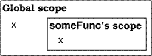

本文对应原书的第六部分，主要介绍使用C++进行面向对象编程时关于继承需要注意的事项。
<!--more-->

## item32 让public继承塑造出is-a关系
用C++进行面向对象编程，最重要的规则就是：public继承要塑造出“**is-a**”的关系。如果一个类D(Derived)以public的形式继承了类B(Base)，那就是在告诉C++编译器，每一个类型为D的对象也是一个类型为B的对象，反之不成立。这就是说任何类型B的对象可以使用的地方，类型为D的对象一样可以使用，因为类D的对象就是一个类型为B的对象。
```
    class Person{...}
    class Student:public Person{...}
```
上述代码描述的就是**is-a**关系，根据日常经验我们知道每个学生都是一个人，当并不是每个人都是学生，这就是public继承体系严格确定的意义。在C++中，如果函数期望获得类型为Person的实参，都可以接受一个Student对象。这种关系只有在Student以public形式继承Person时才成立，private继承的意义与此完全不同(item39)。

---

public继承和is-a的关系听起来很简单，但是有时候直觉可能会误导我们。例如，企鹅是一种鸟，鸟会飞，这些都是事实。我们用C++来描述这一关系：
```
    class Bird
    {
    public:
        virtual void fly();
    }
    class Penguin:public Bird
    {...}
```
在这个继承体系下，我们得出企鹅会飞，但事实上且不会飞。这就是**自然语言的二义性**给我们造成的误导，我们说鸟会飞，真正的意思是一般的鸟都有飞行能力，但是有些鸟不会飞。我们需要更准确的继承体系来更准确的反映我们的真正意思：
```
    class Bird
    {...}
    class FlyingBird:public Bird
    {
    public:
        virtual void fly();
    }
    class Penguin:public Bird
    {...}
```
除了上述修改类的继承体系外，还有一种思想是：为类Penguin重新定义fly函数，让它产生一个运行时错误。在这种情况下，程序能够通过编译器的编译，但是在运行时调用fly函数会给出一个错误提示。这里表达的逻辑就不再是“企鹅不会飞”，而是“企鹅会飞，但这么做是错误的”。
```
    class Penguin:public Bird
    {
    public:
        virtual void fly(){error("Attempt to make a penguin fly!");} // 调用fly函数会提示错误
    }

    Penguin p;
    p.fly(); // 通过编译，运行时会提示错误
```
item18中提到，良好的接口可以防止无效的代码通过编译。因此，上述代码的设计是不合理的。对于某些系统而言，我们不需要区分会飞的鸟和不会飞的鸟，这种情况下原先的两个类的继承体系就能够满足要求。
```
    class Bird
    {...} // 无飞行函数
    class Penguin:public Bird
    {...} // 无飞行函数
```

---

生活的经验给了我们关于对象继承的直觉，然而这样的直觉并不一定是正确的。比如，我们实现一个正方形类继承自矩形类：
```
    class Rectangle
    {
    public:
        virtual void setHeight(int newHeight);
        virtual void setWidth(int newWidth);
        virtual int height() const;
        virtual int width() const;
        ...
    }
    void makeBigger(Rectangle& rect)
    {
        int oldHeight = rect.height();
        rect.setWidth(rect.width()+10); // 宽度增加10
        assert(rect.height()==oldHeight); // 判断高是否改变，
    }

    class Square:public Rectangle{...}
    Square s;
    assert(s.height()==s.width()); // 正方形的高度等于宽度
    makeBigger(s);
    assert(s.height()==s.width()); // 理论上来说应该仍然成立
```
根据正方形的定义，宽高相等应该是在任何时候都成立的。然而`makeBigger`却破坏了正方形的属性，所以在这种情况下正方形并不是一个矩形，即Square继承Rectangle是错误的。C++类的继承比现实世界中的继承关系更为严格，即**适用于基类的属性都要适用于派生类**。
**is-a**并不是唯一存在于类与类之间的关系，另外两个常见的关系是**has-a**和**use-a**，这些关系在item38和item39中讨论。


**Note：总结**
- public继承意味着类与类之间是is-a的关系，适用于基类的每一件事情也适用于其派生类，因为每一个派生类对象也是一个基类对象。


## item33 避免继承中发生的名称覆盖
名称屏蔽的发生其实和继承无关，而是和作用域有关。举个例子：
```
	int x; // 全局变量
	void someFunc()
	{
		double x; // 局部变量
		std::cin>>x;
	}
```

上面代码中于数据读取相关的是局部变量，这是因为内层的作用域名称会屏蔽外部作用域的名称。当编译器在someFunc的作用域中遇到x时，会在当前作用域寻找相关的定义，如果找到就不会再检查其他作用域。在此例中，someFunc的x类型为double，全局x的类型为int，但是这不会影响结果，因为C++名字屏蔽的规则是**只覆盖名称，和类型无关**。

---

在类的继承关系中，派生类能够访问基类的成员，这是因为派生类继承了基类中声明的成员，具体的关系是派生类的作用域嵌套在基类的作用域内。
```
    class Base
    {
    private:
        int x;
    public:
        virtual void mf1()=0;
        virtual void mf2();
        void mf3();
        ...
    }

    class Derived:public Base
    {
    public:
        virtual void mf1();
        void mf4(){ mf2();}
    }
```

上述代码中既涉及了public和private，也涉及了成员变量和成员函数，还涉及了虚函数，纯虚函数和普通函数三种概念，这是为了强调我们讨论的内容至于名称有关，和其他无关。上述代码中，mf4调用了mf2函数。编译器的做法是查找各个作用域，先查找mf4函数的作用域，然后查找类Derived的作用域，接着查找类Base的作用域，类Base所在命名空间的作用域，最后到全局作用域，直到编译器找到mf2为止。

接下来我们在派生类中重载函数mf1和mf3，并且为派生类增加一个新的mf3函数(要避免重定义继承而来的非虚函数，item36)：
```
    class Base 
    {
    private:
        int x;

    public:
        virtual void mf1() = 0;
        virtual void mf1(int); // 基类中重载mf1函数
        virtual void mf2();
        void mf3();
        void mf3(double); // 基类中重载mf3函数
        ...
    };

    class Derived: public Base 
    {
    public:
        virtual void mf1();
        void mf3(); // 增加新的mf3函数
        void mf4();
        ...
    }
```

由于名字屏蔽，上述代码中Base类中所有名为mf1和mf3的函数都被Derived类中名为mf1和mf3的函数覆盖。从名称搜索的观点来看，`Base::mf1`和`Base::mf3`不再被类Derived继承。上述规则，即使基类和派生类中的函数有不同的参数类型也适用，无论是否是虚函数也适用。名称屏蔽的原因是，防止我们在程序库或应用框架内建立一个新的派生类时附带地从遥远的基类中继承重载函数。
```
    Derived d;
    int x;

    d.mf1();  // 正确，调用了Derived::mf1
    d.mf1(x); // 错误，Base::mf1(int)被屏蔽
    d.mf2();  // 正确，调用了Derived::mf2
    d.mf3();  // 正确，调用了Derived::mf3
    d.mf3(x); // 错误，Base::mf3(double)被屏蔽
```

---

如果想要避免C++继承过程中发生的名字屏蔽，可以使用**using声明式**来实现：
```
    class Base
    {
    public:
        virtual void mf1() = 0;
        virtual void mf1(int);
        virtual void mf2();
        void mf3();
        void mf3(double);
    private:
        int x;
    }
    class Derived:public Base
    {
    public:
        // 让类Base中名为mf1和mf3的所有函数在Derived中可见
        using Base::mf1;
        using Base::mf3;
        virtual void mf1();
        void mf3();
        void mf4();
        ...
    }

    // 现在，继承机制可以正常工作
    Derived d;
    int x;
    ...
    d.mf1();   // 正确，调用Derived::mf1
    d.mf1(x);  // 正确，调用Base::mf1
    d.mf2();   // 正确，调用Base::mf2
    d.mf3();   // 正确，调用Derived::mf3
    d.mf3(x);  // 正确，调用Base::mf3
```

从上述代码可以看出，如果继承了一个带有重载函数的基类并且想在派生类中重定义其中的一部分，那么需要在派生类中为不想被屏蔽的名称进行**using声明**。

在public继承中，派生类和基类是is-a的关系，派生类继承了基类的所有函数，但是有的时候我们只想继承某一个重载函数，using声明式在这里派不上用场，因为using声明式会让继承来的给定名称的多有同名函数在派生类中可见。因此，我们需要用到另一种技术——**转发函数(forwarding function)**。
```
    class Base
    {
    public:
        virtual void mf1() = 0;
        virtual void mf1(int);
        ...
    }
    class Derived:public Base
    {
    public:
        virtual void mf1() // 转发函数
        {
            Base::mf1();
        }
        ...
    }

    Derived d;
    int x;
    d.mf1();    // 正确，调用Derived::mf1
    d.mf1(x);   // 错误，Base::mf1(int)b被屏蔽
```
转发函数的另一个作用是帮助那些不支持using声明式的编译器将继承等到的函数引入派生类作用域中。


**Note：总结**
- 派生类中的函数名称会屏蔽基类中的所有同名函数，与函数的参数和返回值无关。
- 为了在派生类中引入被屏蔽的基类函数，可以使用using声明式或转发函数(forwarding function)。


## item34 区分接口继承和实现继承
C++的public继承有两部分组成：**函数接口继承**和**函数实现继承**，这两种继承对应的是函数的声明和函数的实现。在class的设计中，有时候我们希望派生类只继承成员函数的接口；有时候希望派生类同时继承函数的接口和继承，但又希望能够重写它们继承的实现；有时候希望同时继承函数的接口和实现，但是不希望重写实现。为了更好的描述这三者之间的差异，我们考虑一个展现图形绘制的继承体系：
```
    class Shape
    {
    public:
        virtual void draw() =0;
        virtual void error(const std::string& msg);
        int objectedID() const;
        ...
    }
    class Rectangle:public Shape{...}
    class Ellipse:public Shape{...}
```
Shape类声明了三个函数，第一个是`draw`，用来绘制形状；第二个是`error`，准备让需要报出错误的函数调用；第三个是`objectID`，用来返回当前对象的标识码。每个函数的声明方式不同：`draw`是纯虚函数，`error`是虚函数，`objectID`是普通函数。

1. **纯虚函数**
纯虚函数有两个突出的特性：1)必须在具象类中被实现；2)在抽象类中通常没有被定义。这两个性质表明了：**声明一个纯虚函数的目的就是为了让派生类继承函数接口**。Shape是一个抽象类，无法进行实例化，其派生类要进行实例化就必须提供`draw`函数的实现。虽然我们也可以在抽象类中为纯虚函数函数提供定义，但是无法通过对象进行访问，只能通过`shape::draw()`这样的形式进行访问。
```
    Shape* ps = new Shape(); // 错误，Shape无法实例化
    Shape* ps1 = new Rectangle(); // 正确
    ps1->draw(); // 调用Rectangle::draw()
    Shape* ps2 = new Ellipse();
    ps2->draw(); // 调用Ellipse::draw()
    ps1->Shape::draw(); // 调用Shape::draw()
    ps2->Shape::draw();
```

2. **虚函数**
普通的虚函数和纯虚函数有一些不同，普通虚函数不仅提供了继承的函数接口，也提供了默认的函数实现，派生类也可以重写函数的实现。虚函数的性质表明了：**声明一个虚函数的目的是让派生类同时继承函数的接口和默认实现，并能够重写实现**。
```
    class Shape
    {
    public:
        virtual void error(const std::string& msg);
    }
```
该接口表示，每个类都必须提供一个当发生错误时可被调用的函数，但每个类可以自定义错误行为。如果不想自定义，可以使用基类提供的默认实现。但是，允许虚函数同时指定函数声明和函数默认实现的行为，可能会造成危险。我们考虑一个航空公司设计的飞机继承体系：
```
    class Airport{...}
    class Airplane
    {
    public:
        virtual void fly(const Airport& destination);
    }
    void Airplane::fly(const Airport& destination)
    {
        ... // 默认实现
    }

    class ModelA:public Airplane{...}
    class ModelB:public Airplane{...}
```
上述代码中，A型飞机和B型飞机都继承了函数`fly`的默认实现。现新增C型飞机，它的飞行方式与默认方式不同。由于程序员忘记给C重新定义`fly`函数，因此当派生类C调用`fly`函数时会调用默认实现。
```
    class ModelC:public Airplane
    {
        ... // 未声明fly函数
    }

    Airport PDX;
    Airplane* pa = new ModelC;
    ...
    pa->fly(PDX); // 调用Airplane::fly
```
上述代码的问题不在于Airplane::fly有默认实现，而在于ModelC在未明确要调用的情况下就继承了该默认的实现。我们可以通过切断虚函数接口和默认实现之间的直接关系来避免上述的不安全行为。
- **为默认实现定义一个独立的函数**，具体做法是将函数声明为纯虚函数来提供接口，另外定义一个独立的`defaultFly`函数来提供默认的实现。
```
    class Airplane
    {
    public:
        virtual void fly(const Airport& destination) = 0;

    protected:
        void defaultFly(const Airport& destination)
        {
            ... // 默认实现
        }
    }

    class ModelA:public Airplane
    {
    public:
        virtual void fly(const Airport& destination)
        {
            defaultFly(destination);
        }
    }
    class ModelB:public Airplane
    {
    public:
        virtual void fly(const Airport& destination)
        {
            defaultFly(destination);
        }
    }

    class ModelC:public Airplane
    {
    public:
        virtual void fly(const Airport& destination);
    }
```
上述代码中类ModelC不会再出现意外调用默认fly实现的情况，因为纯虚函数要求派生类ModelC必须提供自己的实现。但是上述方案并不是完全安全的，程序员可能因为剪贴(copy-and-paste)代码而造成错误，而且由于函数名称过于相似也会引起class命名空间污染问题。

- **为纯虚函数提供默认实现**，利用*纯虚函数必须在派生类中重新实现，但也可以拥有自己的实现* 这一特性来进行实现。
```
    class Airplane
    {
    public:
        virtual void fly(const Airport& destination) = 0;
    }
    void Airplane::fly(const Airport& destination)
    {
        ... // 默认实现
    }

    class ModelA:public Airplane
    {
    public:
        virtual void fly(const Airport& destination)
        {
            Airport::fly(destination);
        }
    }

    class ModelC:public Airplane
    {
    public:
        virtual void fly(const Airport& destination);
    }
    void ModelC::fly(const Airport& destination)
    {
        ... // 定制实现
    }
```
这与上一个方案一模一样，只不过纯虚函数`Airplane::fly`替换了独立函数`Airplane::defaultFly`。本质上是将fly分割为两个基本要素：声明部分表示的接口以及定义部分表现的默认实现。

3. **普通函数**
如果成员函数是一个非虚函数，这意味着并不打算在派生类中对其进行重写，**声明非虚函数的目的是为了让派生类继承函数的接口以及一个强制的实现**。

纯虚函数、普通虚函数、非虚函数之间的差异可以让我们准确指定派生类继承的东西，即**只继承接口**、**继承接口和默认实现**、或是**继承接口和强制的实现**。由于不同类型的声明有着不同的意义，当我们声明函数时必须要谨慎选择，避免常犯的两个错误：
- **第一个错误是将所有的函数声明为非虚函数**。这使得派生类没有空间进行特殊化，实际上任何一个类只要是被用来作为基类，都会拥有若干的虚函数。
- **第二个错误是将所有成员函数声明为虚函数**。在接口类中这样做是正确的(item37)，但是某些不应该在派生类中被重新定义的函数应该声明为非虚函数。


**Note：总结**
- 接口继承和实现继承不同。在public继承中，派生类总是继承基类的接口。
- 纯虚函数只具体指定接口继承。
- 普通虚函数指定接口继承以及默认的实现继承。
- 非虚函数指定接口继承以及强制性实现继承。


## item35 考虑virtual函数的替代方法
假如我们在设计一个游戏软件，打算为游戏中的角色设计一个继承体系，提供一个`healthValue`成员函数来表示游戏角色的健康状态。最直接的做法就是声明一个virtual函数
```
    class GameCharacter
    {
    public:
        virtual int healthValue() const; // 返回角色的健康状态值
    }
```
上述代码中提供了一个普通的虚函数，这意味着提供了一个默认的实现。这种设计方式简单明白，所以一般都不会去考虑其他的替代设计。但事实上，更好的设计方法是存在的：
- NVI可以实现模板方法模式，用非虚函数来调用更加封装的虚函数
- 用函数指针代替虚函数，实现策略模式
- 用`std::function`实现策略模式，可以支持兼容目标函数签名的可调用对象

1. **通过NVI实现模板方法模式**
所谓的NVI(non-virtual interface)，就是将所有的虚函数声明为private，然后通过一个public non-virtual函数来调用该virtual函数，我们把这个public函数称为virtual函数的**包装器(wrapper)**。
```
    class GameCharacter
    {
    public:
        int healthValue() const
        {
            // do sth before
            int retValue = doHealthValue();
            // do sth after
            return retValue;
        }
    private:
        virtual int doHealthValue() const // 派生类可以重新实现该方法
        {...}
    }
```
上述代码表示的就是NVI方法，它是**模板方法设计模式**的一种独特表现形式。NVI方法的一个优点是可以在调用`doHealthValue`函数前后设置一些上下文的工作，比如给互斥量加锁/解锁、验证前置条件/后置条件、类的不变式等。
上述代码中`doHealthBalue`在派生类中是无法访问的，但是派生类中却对其进行了重新定义。虽然看着有些矛盾，但是C++中支持**在派生类中重新定义继承而来的private virtual函数**。

2. **通过函数指针实现策略模式**
NVI方法对于public virtual函数来说只是一个简单的替代方案，事实上我们可以完全将`healthValue`完全独立出来，让它不受角色的影响，只在构造函数时将该函数作为参数传入。
```
    class GameCharacter; // 前置声明
    int defaultHealthCalc(const GameCharacter& gc); // 默认的计算方法
    class GameCharacter // 
    {
    public:
        typedef int (*HealthCalcFunc)(const GameCharacter& gc); // 声明一个函数指针
        explicit GameCharacter(HealthCalcFunc hcf = defaultHealthCalc): // 传入函数指针
        healthFunc(hcf){}
        int healthValue() const
        {
            return healthFunc(*this);
        }
        ...
    private:
        HealthCalcFunc healthFunc;
    }
```
上述代码就是一个常见的**策略设计模式**的简单应用。相较于public virtual函数，它提供了一些设计的灵活性：
- 同一个角色类的不同对象可以有不同的`healthCalcFunc`，只需要在构造时传入不同的策略就可实现。
- 角色的`healthCalcFunc`可以动态待变，只需要提供一个`setHealthCalclator`成员方法即可。

```
    class EvilBadGuy:public GameCharacter
    {
    public:
        explicit EvilBadGuy(HealthCalcFunc hcf = defaultHealthCalc)
        :GameCharacter(hcf)
        {...}
        ...
    }
    int loseHealthQuickly(const GameCharacter&); // 计算方法1
    int loseHealthSlowly(const GameCharacter&);  // 计算方法2 

    EvilBadGuy ebg1(loseHealthQuickly); // 相同类型的角色设置不同的计算方法
    EvilBadGuy ebg2(loseHealthSlowly);
```
我们使用外部函数实现了策略模式，但因为`healthCalcFunc`是外部函数，这就意味着其无法访问类的私有成员。一般来说，解决方法是：**弱化class的封装**，或者**为实现提供public成员**。两种方案的选择需要根据实际问题来进行权衡。

3. **通过std::function实现策略模式**
事实上，通过函数指针来实现策略模式过于死板，我们完全可以使用`std::function`对象来替代函数指针。`std::function`是一种**通用的多态函数包装器**，它是一个对象，这就意味它可以保存任意一种类型兼容的可调用实体(callable entity)，如函数对象，成员函数指针，lambda表达式等。
```
    class GameCharacter; // 前置声明
    int defaultHealthCalc(const GameCharacter& gc); // 默认的计算方法
    class GameCharacter // 
    {
    public:
        typedef istd::function<int (const GameCharacter&)> HealthCalcFunc; // 使用std::function
        explicit GameCharacter(HealthCalcFunc hcf = defaultHealthCalc): 
        healthFunc(hcf){}
        int healthValue() const
        {
            return healthFunc(*this);
        }
        ...
    private:
        HealthCalcFunc healthFunc;
    }
```
和使用函数指针的不同在于，上述代码用`std::function`声明了一个目标签名式(target signature)，表示接受一个指向`const GameCharacter`的引用作为参数，并返回一个int。声明的`HealthCalcFunc`可以持有任何与签名式兼容的可调用实体。所谓的兼容，意思是这个可调用实体的参数可以被隐式转换为`const GameCharacter`，其返回类型可以被隐式转换为int。
```
    short calcHealth(const GameCharacter&); // 健康计算方法，返回值为short

    struct HealthCalculator
    {
        int operator()(const GameCharacter&) const
        {...}
    };
    class GameLevel
    {
    public:
        float health(const GameCharacter&) const; // 成员函数，返回值为float
    }

    class EvilBadGuy:public GameCharacter
    {...}
    class EyeCandyCharacter:public GameCharacter
    {...}

    EvilBadGuy ebg1(calcHealth); // 人物1，使用某个函数计算健康值
    EyeCandyCharacter ecc1(HealthCalculator()); // 人物2，使用某个函数对象计算健康值
    GameLevel currentLevel;
    EvilBadGuy ebg2(std::bind(&GameLevel::health,currentLevel,_1)); // 人物3，使用某个成员函数计算健康值
```
上述代码中，无论时类型兼容的函数、函数对象还是成员函数，都可以用来初始化一个`GameCharacter`对象。同时，需要注意的是`std::bind`的用法。

4. **经典策略模式**
忽略上面关于策略模式的实现，我们讨论更一般的实现方式。经典的策略模式会将健康计算函数设计成一个分离的继承体系中virtual成员函数，其UML设计图为:

如图所示，`GameCharacter`是某个继承体系的根类，体系中的`EvilBadGuy`和`EyeCandyCharacter`都是派生类，`HealthCalcFunc`是另一个继承体系的根类，体系中的`SlowHealthLoser`和`FastHealthLoser`都是派生类，每个`GameCharacter`对象都包含一个指针，用来指向一个来自`HealthCalcFunc`继承体系的对象。
```
    class GameCharacter;
    class HealthCalcFunc
    {
    public:
        virtual int calc(const GameCharacter& gc) const;
    }
    HealthCalcFunc defaultHealthCalc;
    class GameCharacter
    {
    public:
        explicit GameCharacter(HealthCalcFunc *phcf = &defaultHealthCalc)
        :pHealthCalc(phcf)
        {}
        int healthValue() const
        {
            return pHealthCalc->calc(*this);
        }
    private:
        HealthCalcFunc* pHealthCalc;
    }
```
熟悉策略模式的人一眼就能看出上述代码是策略模式的经典实现，其可以通过继承`HealthCalcFunc`很方便的生成新的策略。


**Note：总结**
- virtual函数的替代方案包括：NVI方法以及上面提到的三种策略设计模式。
- 将功能提取到外部函数的缺点是非成员函数无法访问类的私有成员。
- std::function对象的行为就像一般的函数指针，但是其可以接受任何类型兼容的可调用实体。


## item36 不要重写继承来的非虚函数
例如,类D以public的形式继承了类B，类B定义了一个public成员函数mf：
```
    class B
    {
    public:
        void mf();
        ...
    }
    class D:public B
    {
    public:
        void mf(); // 覆盖率B::mf()
        ...
    }

    // 
    D x;
    B* pB = &x;
    D* pD = &x;
    pB->mf(); // 调用的是B::mf
    pD->mf(); // 调用的是D::mf
```
上述代码中，指针`pB`和`pD`都指向的是派生类的对象，并通过对象来调用成员函数mf。两者指向的对象相同，调用的函数也相同，但是其功能却不一样。原因是：非虚函数B::mf和D::mf都是**静态绑定**，即函数依赖于对象的静态类型，发生在编译期。意思是`pB`是一个类型为B的指针，通过`pB`调用的非虚函数永远都是类B中定义的版本。
另一方面，虚函数则是**动态绑定**的，发生在运行期，函数依赖于动态类型。由于`pB`和`pD`指向的都是类型为D的对象，所以两者调用的都是对象x中的虚函数。


事实上，在派生类中重新定义基类的非虚函数在设计上是矛盾的。基类中声明的非虚函数意味着适用于基类对象的特性同样适用于派生类对象。如果重新定义了非虚函数，那么派生类和基类就不再是is-a的关系。


**Note：总结**
- 在任何情况下都不要去重新定义一个继承来的非虚函数。


## item37 不要重定义通过继承得到的默认参数值
我们将需要继承的函数分为两类：**virtual函数**和**non-virtual函数**，对继承来的non-virtual函数进行重新定义是错误的(item36)，所以本节主要讨论**继承一个带有默认参数的virtual函数**。不要重新定义继承来的默认参数值成立的原因是，**虽然虚函是动态绑定的，但是默认参数是静态绑定的，只有动态绑定的东西才应该被重写**。静态绑定是在编译期决定的，又称前期绑定；动态绑定是在运行期决定的，又称后期绑定。

对象的**静态类型**，就是它在程序中被声明时采用的类型。对于以下的class继承体系：
```
    class Shape
    {
    public:
        enum ShapeColor{Red,Green,Blue};
        // 提供一个绘制函数
        virtual void draw(ShapeColor color=Red) const=0;
        ...
    }

    class Rectangle:public Shape
    {
    public:
        // 给派生类赋予不同的默认参数值
        virtual void draw(ShapeColor color=Green) const;
        ...
    }
    class Circle:public Shape
    {
    public:
        virtual void draw(ShapeColor color) const;
    }

    // 考虑指针
    Shape* ps;                 // 静态类型为Shape*
    Shape* pc = new Circle;    // 静态类型为Shape*
    Shape* pr = new Rectangle; // 静态类型为Shape*
```
在上述代码中，`ps`，`pc`和`pr`都声明为Shape类型的指针，无论它们指向什么对象，它们的动态类型都是`Shape*`。
对象的**动态类型**就是当前指向的对象的类型，也就是说动态类型决定了一个对象会有什么行为。在上述代码中，`pc`的动态类型是`Circle*`，`pr`的动态类型是`Rectangle*`，`pc`没有动态类型，因为其没有指向任何对象。virtual函数就是通过动态绑定来决定在运行时调用哪一个函数实现代码：
```
    pc->draw(Shape::Red); // 调用Circle::draw(Shape::Red)
    pr->draw(Shape::Red); // 调用Rectangle::draw(Shape::Red)
```

---

virtual函数是动态绑定的，而默认参数值却是静态绑定的。这就意味着我们可能会调用一个定义于派生类中的virtual函数的同时，却使用了基类为其指定的默认参数值。
```
    pr->draw(); // 调用Rectangle::draw(Shape::Red)
```
在上述代码中，`pr`的动态类型是`Rectangle*`，所以调用的是Rectangle的函数实现，`Rectangle::draw()`的默认参数是`Green`。但是`pr`的静态类型是`Shape*`，所以实际调用的默认参数值来自于基类Shape而不是派生类Rectangle。
C++之所以选择这样的方式来运作是**为了保证运行时效率**。如果默认参数值是动态绑定，编译器就必须要通过某种方法在运行期为virtual函数决定适当的默认参数值，这比直接在编译期的机制更加缓慢和复杂。

解决矛盾的方法就是考虑virtual函数的替代设计。item35中提供了virtual函数的替代设计，其中之一是NVI(non-virtual interface)方法：让基类中的public非虚函数调用private虚函数，后者可以被派生类重定义。在这里，我们可以让非虚函数指定默认参数值，private虚函数负责功能实现。
```
    class Shape
    {
    public:
        enum ShapeColor{Red,Green,Blue};
        void draw(ShapeColor color=Red) const
        {
            doDraw(color);
        }
    private:
        virtual void doDraw(ShapeColor color) const =0;

    }
     class Rectangle:public Shape
     {
    public:
        ...
    private:
        virtual void doDraw(ShapeColor color) const;
     }
```
上述代码中，由于非虚函不应该在派生类中被重新定义，所以这个设计可以很清楚地使得draw函数的color默认值参数总是为Red。


**Note：总结**
- 不要在派生类中重新定义继承得到的默认参数值，因为默认参数值是静态绑定的，而virtual函数是动态绑定的。


## item38 通过组合塑造has-a或use-a关系
组合是类型之间的一种关系，当某种类型的对象内包含其他类型的对象，就是组合关系。如下面的代码中，Person对象由std::string，Address，PhoneNumber组成。
```
    class Address{...}
    class PhoneNumber{...}

    class Person
    {
    public:
        ...
    private:
        std::string name;
        Address address;
        PhoneNumber faxNumber;
    }
```
item32中提到，public继承有is-a的意义。组合也有它自己的意义，事实上它有两种意义，即**has-a**(包含)意义和**use-a**(依赖)意义。这是因为我们在软件中会处理两个不同的领域(domain)，程序中的一些对象对应现实世界中的某些事物，如人、汽车、视频画面等等，这样的对象属于应用领域；其他的对象则只是实现工具，如缓冲区、互斥器、搜索树等等，这些对象属于实现领域。当组合发生于应用域的对象之间，表现出**has-a**的关系；当组合发生于实现域，表现出的就是**use-a**的关系。

上面的Person类展示了**has-a**的关系，Person有一个名称，一个地址以及电话号码。**has-a**和**is-a**之间不难区分，比较难以区分的是**is-a**和**use-a**关系。假设要使用一个list对象来实现一个Set对象，我们可能会想到说让Set类继承List类，这样可以使用List的一些现有的属性和方法。但是list中允许包含重复元素，set中不包含重复元素，这样set和list就不是is-a的关系，不适合用public继承来塑造。正确的方法是，Set对象通过使用一个List对象来实现：
```
    template<class T>
    class Set
    {
    public:
        bool member(const T& item) const;
        bool insert(const T& item);
        voie remove(const T& item);
        std::size_t size() const;
    private:
        std::list<T> rep; // 用来描述set的数据
    }
```
类Set的成员函数可依赖List以及标准库来完成。一个类型使用另一个类型的属性和方法来实现自己的功能，塑造出的就是**use-a**的关系。
```
    template<typename T>
    bool Set<T>::member(const T& item) const
    {
        return std::find(rep.begin(),rep.end())!=rep.end();
    }
    template<typename T>
    void Set<T>::insert(const T& item)
    {
        if (!member(item)) 
            rep.push_back(item);
    }

    template<typename T>
    void Set<T>::remove(const T& item)
    {
        typename std::list<T>::iterator it =               // see Item 42 for info on
            std::find(rep.begin(), rep.end(), item);       // "typename" here
        if (it != rep.end()) 
            rep.erase(it);
    }

    template<typename T>
    std::size_t Set<T>::size() const
    {
        return rep.size();
    }
```
综上，**has-a**关系是将一个类当作另一个类的属性；**use-a**关系是在一个类中使用了另一个类的对象的成员。


**Note：总结**
- 组合和public继承的意义完全不同。
- 在应用域，组合意味着has-a的关系，即一个类型中包含了另一个类型的对象作为属性。
- 在实现域，组合意味着use-a的关系，即一个类使用了另一个类的数据和方法来实现自生的功能。


## item39 慎用private继承
item32中提出了在C++中public继承描述的是is-a的关系，这是因为编译器会在必要的时候将派生类对象隐式转换为基类对象。我们考虑用private来替换item32中的public继承：
```
    class Person{...}
    class Student:private Person{...}; // 私有继承
    void eat(const Person& p); //

    Person p;  // p is a Person
    Student s; // s is a Student
    eat(p);    // 正确
    eat(s);    // 错误
```
上述代码中，`Person`对象可以正确调用，但是`Student`对象不能正确调用。这就是private继承和public继承的不同之处：
- 在private继承中，编译器不会自动将一个派生类对象转换为一个基类对象；
- 由private从基类中继承来的所有成员，包括public和protected，都会变成private属性。

---

在private继承中，派生类继承了基类的实现，没有继承基类的接口，这就意味着**private继承只是一种软件实现的方式，与软件设计无关**。private继承和item38中的组合一样，都可以表示use-a的关系。我们如何在两者之间进行取舍呢？答案很简单：尽可能使用组合，必要时才使用private继承。

我们设计一个Widget类，让它记录每个成员函数被调用的次数。为了完成这个任务，我们还需要设计一个定时器：
```
    class Timer
    {
    public:
        explicit Timer(int tickFrequency);
        virtual void onTick() const;
    }

    class Widget::private Timer
    {
    private:
        virtual void onTick() const;
    }
```
上述代码中，为了能在Widget中重新定义Timer的虚函数，Widget必须继承Timer。但是public继承不适用于此种情况，因为Widget与Timer不是is-a的关系。因此必须使用private方式继承Timer，这样Timer中的public函数`onTicker()`在Widget中变成`private`，这样既可以在Widget中实现对函数的重定义，又可以避免public继承可能造成的接口误用(item18)。上述代码的功能也可以通过组合的方式实现：
```
    class Widget
    {
    private:
        class WidgetTimer:public Timer
        {
        public:
            virtual void onTick() const;
            ...
        }
        WidgetTimer timer;
    }
```
上述代码的组合方式虽然比private继承略微复杂一点，但是实现了相同的功能。建议尽可能使用组合替代private继承的原因，可以考虑以下两种情况：
1. 我们需要将Widget设计为一个基类，但是我们不想在派生类中重新定义`onTick`。如果Widget与Timer之间的关系是继承，这样的设计是无法实现的(item35，派生类中需要重新定义虚函数，即使不会使用)。但是如果WidgetTimer是Widget中的一个private成员，Widget的派生类将无法获得WidgetTimer对象的值，就无法继承或重新定义它的虚函数。
2. 最小化Widget的编译依赖性。如果Widget继承了Timer，那么Widget被编译时Timer的定义就必须可见，这就意味着Widget的定义文件必须要`#include Timer.h`。如果将WidgetTimer移出Widget之外而通过一个指针指向WidgetTimer对象，Widget就可以只需要一个WidgetTimer的声明式，不再需要`#include`任何与Timer相关的东西。

private继承的实现非常简单，而且有时只能使用private继承：
- 当派生类需要访问基类中的protected成员时。因为对象组合后只能访问public成员，而private继承可以访问protected成员。
- 派生类需要重新定义基类中的虚函数时。

---

我们考虑一个不带任何数据的空白基类，其对象理论上应该是不使用任何空间的，因为对象中没有任何数据需要存储。但是C++指定**凡是独立的对象都必须有非零的大小**。
```
    class Empty{}
    class HoldsAnInt
    {
    private:
        int x;
        Empty e; // 独立的对象
    }
```
上述代码中，`Empty`的对象是一个独立对象，编译器会给其分配一个内存，因此会有`sizeof(HoldsAnInt) > sizeof(int)`。
如果我们通过使用private继承Empty，这样编译器就不会为其分配空间，因为派生类中的基类成分并不是一个独立对象。
```
    class HoldsAnInt:private Empty
    {
    private:
        int x;
    }
```
在上述代码中，`sizeof(HoldsAnInt) == sizeof(int)`是成立的，这就是所谓的**EBO(empty base optimization，即空白基类最优化)。如果我们的程序特别在意空间消耗，就可以使用EBO，而且EBO一般只用在单继承中。现实中的类一般都不是空白类，所以这种情况并不多见。


**Note：总结**
- private继承描述的是use-a的关系，但是在编程过程中还是优先使用组合的方式。只有在派生类需要访问基类的protected成员，或者需要重新定义继承而来的virtual函数时，才使用private继承。
- 和组合不同，private继承可以实现空白基类的最优化。


## item40 慎用多继承
所谓的多继承，就是一个类有一个以上的基类。这就意味着程序有可能东一个以上的基类中继承相同的名称(如函数，typedef等)，这会导致**基类名称调用的歧义性**。
```
    class A
    {
    public:
        void chechOut();
    }
    class B
    {
    private:
        void checkOut();
    }
    class MP3Player:public A,
                    private B
    {...}

    MP3Player mp;
    mp.checkOut(); // 会发生歧义，无法确定调用的是哪个函数
```
C++中调用重载函数的规则是：首先确认调用函数的匹配度，找出最佳匹配后才会验证其是否可调用。因此上述代码中对`checkOut`的调用是有歧义的，即使一个是public，另一个是private，它们的匹配程度是一样的，没有最佳匹配。为了解决歧义性，需要明确指出调用的是哪一个基类的函数：
```
    mp.A::checkOut(); // 调用的是A::checkOut()
```

---

在多继承中，如果基类拥有更高的基类，就有可能导致**菱形继承**。
```
    class File{}
    class InputFile:public File{}
    class OutputFile:public File{}
    class IOFile:public InputFile, public OutputFile{}
```

我们假设类File中有一个成员变量filename，那么IOFile继承下来的filename成员变量应该有多少个呢，一个或者两个？事实上，C++两种情况都支持，默认是保存两份数据的方式。如果只需要保存一份，就需要让类File称为一个虚基类，这样就需要让所有直接继承File类的派生类使用**virtual继承**。
```
    class File{}
    class InputFile:virtual public File{}
    class OutputFile:virtual public File{}
    class IOFile:public InputFile,
                 public OutputFile
    {...}
```

C++标准库中包含了一个多重继承体系，名称分别为`basic_ios`，`basic_istream`，`basic_ostream`和`basic_iostream`。
为了保证程序的正确性，我们希望public继承都是virtual。但是，正确性有时候并不是我们唯一需要考虑的。虚继承的实例化的对象要比普通的对象占用更多的空间，访问virtual基类的成员变量的速度也比non-virtual基类的成员变量要慢。另外，virtual基类的初始化责任是由继承体系中最底层的派生类来完成的，而且要负责初始化整个继承链上所有虚基类的初始化。
作者对于birtual继承的建议是：第一，尽量不要使用virtual基类；第二，如果必须使用virtual基类，要避免在其中放置数据变量。这样可以减少因为初始化带来的意想不到的错误。

---

上面提到的不包含数据的虚基类，在C++中我们称为接口类。item31中，一个`Person`的接口类定义为：
```
    class IPerson
    {
    public:
        virtual ~IPerson();
        virtual std::string name() const = 0;
        virtual std::string birthDate() const = 0;
    }
```
用户只能通过指针或引用来使用IPerson，因为抽象类无法进行实例化来创建对象。为了创建一个IPerson对象，用户可以使用factory functions(工厂函数，item31)来讲派生自IPerson的具体类进行实例化。
```
    // 工厂函数，根据一个数据库ID创建一个Person对象
    std::shared_ptr<IPerson> makePerson(DatebaseID personIdentifier);
    // 从用户手上获取一个数据库ID
    DatabaseID askUserForDatabaseID();

    DatabaseID id(askUserForDatabaseID());
    std::shared_ptr<IPerson> pp(makePerson(id)); // 创建一个对象支持IPerson接口
```

多继承的一个重要的应用就是：组合public继承的接口类和private继承的实现类。即：
```
    class IPerson
    {
    public:
        virtual ~IPerson();
        virtual std::string name() const = 0;
        virtual std::string birthDate() const = 0;
    }
    class DatabaseID{...}
    class PersonInfo  // 包含若干函数，实现IPerson接口
    {
    public:
        explicit PersonInfo(DatabaseID pid);
        virtual ~PersonInfo();
        virtual const char* theName() const;
        virtual const char* theBirthDate() const;
        virtual const char* valueDelimOpen() const;
        virtual const char* valueDelimClose() const;
    }

    class CPerson:public IPerson,private PersonInfo
    {
    public:
        explicit CPerson(DatabaseID pid):PersonInfo(pid){}
        virtual std::string name() const
        {
            return PersonInfo::theName();
        }
        virtual std::string birthDate() const
        {
            return PersonInfo::theBirthDate();
        }
    private:
        const char* valueDelimOpen() const // 重新定义继承来的函数
        {
            return "";
        }
        const char* valueDelimClose() const // 重新定义继承来的函数
        {
            return "";
        }
    }
```


**Note：总结**
- 多继承比单继承复杂，多继承可能导致调用的歧义性以及菱形继承。
- 解决菱形继承问题需要用到虚继承，但是虚继承会带来更多的空间消耗和时间消耗，以及复杂的初始化成本。不带数据成员的虚基类是最有价值的。
- 多重继承有它的合理用途，即把public继承接口类和private继承协助实现类结合起来。


## 参考文献 & 资源链接
- [Effective C++ 32：确保public继承是"is a"的关系](https://harttle.land/2015/08/30/effective-cpp-32.html)
- [Effective C++](https://www.ctolib.com/docs/sfile/effective-cpp/index.html)